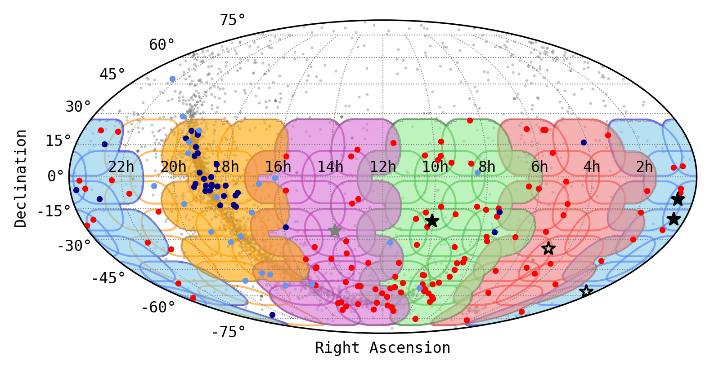
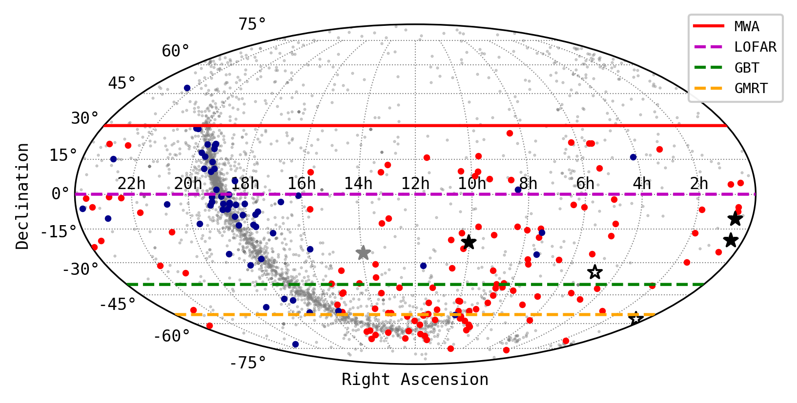

Observation Plotting
====================

The following are examples of how to plot MWA observations.
There are several options that can be viewed with ``plot_obs.py -h``.
If there are no options for what you want to plot you may need to edit the plotting script manually (``scripts/plotting/plot_obs_pulsar.py``).

SMART observations and all MWA pulsars
--------------------------------------

The SMART observations that have been completed and the different types of pulsars detected with the MWA::

    plot_obs_pulsar.py --smart --contour --fwhm --pulsar_discovered --pulsar_rediscovered --pulsar_unpublished --pulsar_all --shade <SMART obs ids> --pulsar <pulsars detected with smart> --pulsar_other <pulsars detected with MWA coherent> --pulsar_other_other <pulsars detected with MWA incoherent>

The below example plot was generated with the following command::

    plot_obs_pulsar.py --smart --contour --fwhm --pulsar_discovered --pulsar_rediscovered --pulsar_unpublished --pulsar_all --shade 1221399680 1221832280 1222435400 1222697776 1223042480 1225713560 1226062160 1255444104 1224252736 1227009976 1224859816 1225118240 1225462936 1252177744 1252780888 1253471952 1253991112 1254594264 1255197408 1255803168 1256407632 1257010784 1257617424 1258221008 1259685792 1259427304 1260638120 1261241272 1265983624 1265725128 1266155952 1266329600 1266932744 1264867416 1265470568 1266680784 1267111608 1267283936 1267459328 1268063336 1268321832 1300809400 1300981728 1301240224 1301412552 1301674968 1301847296 1302106648 1302712864 1302540536 1302282040 1366736704 1367512184 1367342464 1367428632 1367946928 1368033096 1368550080 1368640168 1369415648 1369505736 1369764224 1369936552  --pulsar J0030+0451 J0034-0534 J0034-0721 J0038-2501 J0051+0423 J0133-6957 J0134-2937 J0151-0635 J0152-1637 J0206-4028 J0255-5304 J0304+1932 J0401-7608 J0418-4154 J0437-4715 J0450-1248 J0452-1759 J0459-0210 J0514-4408 J0520-2553 J0525+1115 J0528+2200 J0534+2200 J0600-5756 J0601-0527 J0614+2229 J0624-0424 J0630-2834 J0636-4549 J0729-1448 J0729-1836 J0737-3039A J0742-2822 J0758-1528 J0820-1350 J0820-3921 J0820-4114 J0823+0159 J0826+2637 J0835-4510 J0837+0610 J0837-4135 J0842-4851 J0855-3331 J0856-6137 J0902-6325 J0904-7459 J0905-6019 J0907-5157 J0908-1739 J0922+0638 J0924-5302 J0924-5814 J0942-5552 J0942-5657 J0943+1631 J0944-1354 J0946+0951 J0953+0755 J0955-5304 J0959-4809 J1003-4747 J1012-2337 J1018-1642 J1022+1001 J1034-3224 J1041-1942 J1057-5226 J1059-5742 J1112-6926 J1116-4122 J1121-5444 J1123-4844 J1123-6651 J1136+1551 J1136-5525 J1141-6545 J1146-6030 J1202-5820 J1224-6407 J1225-5556 J1239-6832 J1240-4124 J1257-1027 J1300+1240 J1311-1228 J1312-5402 J1313+0931 J1320-5359 J1328-4357 J1332-3032 J1335-3642 J1340-6456 J1355-5153 J1418-3921 J1430-6623 J1440-6344 J1453-6413 J1455-3330 J1456-6843 J1507-4352 J1510-4422 J1527-3931 J1534-5334 J1543+0929 J1543-0620 J2048-1616 J2108-3429 J2145-0750 J2155-3118 J2222-0137 J2234+2114 J2241-5236 J2317+2149 J2324-6054 J2325-0530 J2330-2005 J2336-01 J2354-22 J1358-2533 --pulsar_other J0407+1607 J0725-1635 J0726-2612 J1555-2341 J1735-0724 J1741-0840 J1743-1351 J1748-1300 J1801-0357 J1807-0847 J1819-1318 J1820-0427 J1823+0550 J1833-0338 J1834-0010 J1834-0426 J1839-0627 J1847-0402 J1849-0636 J1851-0053 J1901+0156 J1909+1102 J1910-0309 J1913-0440 J1916+0951 J1917+1353 J1921+1948 J1922+2110 J1939+2134 J1946+1805 J2053-7200 J2253+1516 J2256-1024 J2346-0609 --pulsar_other_other J0823+0159 J1001-5507 J1141-3107 J1544-5308 J1607-0032 J1645-0317 J1709-1640 J1711-5350 J1731-4744 J1751-4657 J1752-2806 J1823-3106 J1825-0935 J1900-2600 J1902-5105 J1921+2153 J1932+1059 J1935+1616 J1943-1237 J2018+2839 J2046-0421 J2219+4754

Detection limits and all MWA pulsars
------------------------------------

The detection declinations limits of low frequency pulsar telescopes and the different types of pulsars detected with the MWA::

    plot_obs_pulsar.py --pulsar_discovered --pulsar_rediscovered --pulsar_unpublished --lines --pulsar_all --pulsar <SMART known pulsars> --pulsar_other <pulsars detected with MWA>

The below example plot was generated with the following command::

    plot_obs_pulsar.py --pulsar_discovered --pulsar_rediscovered --pulsar_unpublished --lines --pulsar_all --pulsar J2354-22 J2336-01 J2330-2005 J2325-0530 J2324-6054 J2317+2149 J2248-0101 J2241-5236 J2234+2114 J2222-0137 J2155-3118 J2145-0750 J2108-3429 J2048-1616 J1543-0620 J1543+0929 J1536-4948 J1534-5334 J1527-3931 J1510-4422 J1507-4352 J1456-6843 J1455-3330 J1453-6413 J1440-6344 J1430-6623 J1418-3921 J1355-5153 J1340-6456 J1335-3642 J1332-3032 J1328-4357 J1320-5359 J1313+0931 J1312-5402 J1311-1228 J1300+1240 J1257-1027 J1240-4124 J1239-6832 J1225-5556 J1224-6407 J1202-5820 J1146-6030 J1141-6545 J1136-5525 J1136+1551 J1123-6651 J1123-4844 J1121-5444 J1116-4122 J1112-6926 J1059-5742 J1057-5226 J1041-1942 J1034-3224 J1022+1001 J1018-1642 J1012-2337 J1003-4747 J0959-4809 J0955-5304 J0953+0755 J0946+0951 J0944-1354 J0943+1631 J0942-5657 J0942-5552 J0924-5814 J0924-5302 J0922+0638 J0908-1739 J0907-5157 J0905-6019 J0904-7459 J0902-6325 J0856-6137 J0855-3331 J0842-4851 J0838-3947 J0837-4135 J0837+0610 J0835-4510 J0826+2637 J0823+0159 J0820-4114 J0820-3921 J0820-1350 J0758-1528 J0749-4247 J0742-2822 J0737-3039A J0729-1836 J0729-1448 J0702-4956 J0636-4549 J0630-2834 J0624-0424 J0614+2229 J0601-0527 J0600-5756 J0534+2200 J0528+2200 J0525+1115 J0520-2553 J0514-4408 J0459-0210 J0452-1759 J0450-1248 J0437-4715 J0418-4154 J0401-7608 J0304+1932 J0255-5304 J0206-4028 J0152-1637 J0151-0635 J0134-2937 J0133-6957 J0051+0423 J0038-2501 J0034-0721 J0034-0534 J0030+0451 --pulsar_other J2346-0609 J2256-1024 J2253+1516 J2219+4754 J2053-7200 J2046-0421 J2022+2854 J2018+2839 J1946+1805 J1943-1237 J1939+2134 J1935+1616 J1932+1059 J1922+2110 J1921+2153 J1921+1948 J1917+1353 J1916+0951 J1913-0440 J1910-0309 J1910-0112 J1909+1102 J1902-5105 J1901+0156 J1900-2600 J1851-0053 J1849-0636 J1847-0402 J1839-0627 J1834-0426 J1834-0010 J1833-0338 J1825-0935 J1823-3106 J1823+0550 J1820-0427 J1819-1318 J1807-0847 J1801-0357 J1752-2806 J1751-4657 J1748-1300 J1743-1351 J1741-0840 J1735-0724 J1731-4744 J1711-5350 J1709-1640 J1645-0317 J1607-0032 J1555-2341 J1544-5308 J1141-3107 J1001-5507 J0823+0159 J0726-2612 J0725-1635 J0407+1607

